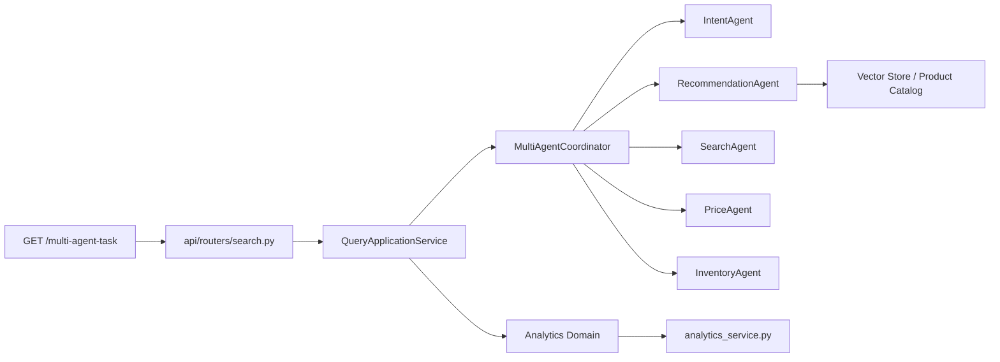
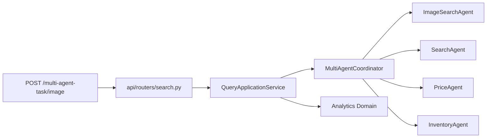
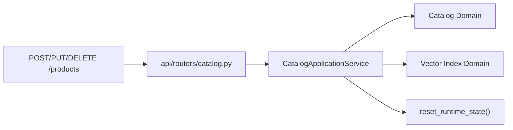

# AI Shopping Assistant Architecture

## 1. 当前定位

当前项目采用的是“单体应用 + 清晰分层 + 按领域聚合”的架构。

目标不是立刻拆成微服务，而是在单机开发阶段先把以下问题解决好：

- 主链路稳定可运行
- 搜索、推荐、价格、库存、画像、分析这些能力边界清楚
- API、应用编排、领域能力、基础设施依赖方向可控
- 后续如果需要拆模块或拆服务，具备自然演进空间

---

## 2. 架构总览

当前后端目录分为五层：

### `app/api`

HTTP API 层。

职责：

- 定义路由入口
- 接收请求参数
- 做轻量参数校验
- 调用应用层服务
- 保持接口路径和响应结构稳定

当前拆分：

- `routers/search.py`
- `routers/catalog.py`
- `routers/profiles.py`
- `routers/vector_index.py`
- `routers/analytics.py`
- `schemas.py`
- `dependencies.py`
- `router.py`

### `app/application`

应用层。

职责：

- 编排一个完整用例
- 收口副作用
- 连接 API 层与领域层
- 避免路由直接操作基础设施

当前服务：

- `query_application_service.py`
- `catalog_application_service.py`
- `profile_application_service.py`
- `vector_application_service.py`
- `analytics_application_service.py`
- `runtime.py`

### `app/domains`

领域聚合层。

职责：

- 用业务领域视角暴露能力
- 把“散落在 agents/services 的能力”归拢成领域入口
- 给应用层提供更稳定的依赖对象

当前领域：

- `catalog`
- `profiles`
- `analytics`
- `vector_index`
- `query_understanding`
- `recommendation`
- `pricing`
- `inventory`
- `multimodal`

### `app/agents`

智能能力层。

职责：

- 承载推荐、价格、库存、意图解析、图片搜索等业务智能逻辑
- 更偏“决策能力”和“规则组合”

当前 Agent：

- `IntentAgent`
- `RecommendationAgent`
- `SearchAgent`
- `PriceAgent`
- `InventoryAgent`
- `ImageSearchAgent`

### `app/services`

基础设施层。

职责：

- 负责数据存取、文件 IO、索引、模型加载、分析日志等底层实现
- 更偏“怎么做”，不负责业务流程编排

当前服务：

- `product_service.py`
- `user_profile_service.py`
- `vector_store_service.py`
- `analytics_service.py`
- `llm_client.py`
- `embedding_service.py`

---

## 3. 目录视图

```text
backend/app
├── api
│   ├── dependencies.py
│   ├── router.py
│   ├── routers
│   │   ├── analytics.py
│   │   ├── catalog.py
│   │   ├── profiles.py
│   │   ├── search.py
│   │   └── vector_index.py
│   └── schemas.py
├── application
│   ├── analytics_application_service.py
│   ├── catalog_application_service.py
│   ├── profile_application_service.py
│   ├── query_application_service.py
│   ├── runtime.py
│   └── vector_application_service.py
├── domains
│   ├── analytics
│   ├── catalog
│   ├── inventory
│   ├── multimodal
│   ├── pricing
│   ├── profiles
│   ├── query_understanding
│   ├── recommendation
│   └── vector_index
├── agents
├── services
├── main.py
├── multi_agent_coordinator.py
└── routes.py
```

说明：

- `routes.py` 当前保留为兼容入口，避免影响既有测试和导入方式
- 真正的 HTTP 入口已经迁移到 `app/api/router.py`

---

## 4. 依赖方向

推荐依赖方向如下：

```text
API -> Application -> Domains -> Agents / Services
```

约束：

- `api` 不直接调用底层 `services`
- `application` 负责组织用例，不直接暴露 HTTP 细节
- `domains` 负责对外提供业务能力入口
- `agents` 尽量不要直接依赖 `api`
- `services` 不承担业务编排职责

---

## 5. 核心请求链路

### 文本搜索



### 图片搜索



### 商品管理



---

## 6. 当前领域边界

### Catalog

职责：

- 商品目录读写
- 商品数据缓存刷新
- 商品基础数据路径与存储

### Profiles

职责：

- 用户画像读取
- 用户画像更新
- 画像合并逻辑

### Recommendation

职责：

- 推荐召回
- 排序
- 推荐理由生成
- 多商家候选生成

### Pricing

职责：

- 动态折扣
- 促销策略
- 价格标签
- 最优报价生成

### Inventory

职责：

- 仓库选择
- 库存状态
- 发货时效
- 预售和限购规则

### Query Understanding

职责：

- 用户查询解析
- 类目识别
- 品牌识别
- 预算和场景识别

### Multimodal

职责：

- 图片搜索
- 图片搜索降级逻辑

### Analytics

职责：

- 推荐事件日志
- 点击/收藏/购买意向反馈日志
- 汇总与 dashboard 聚合

### Vector Index

职责：

- 向量存储创建
- 索引重建
- 本地索引状态查询
- 商品变更后的索引同步

---

## 7. 当前设计原则

### 原则 1：先单体，再边界

当前阶段不拆微服务，但代码边界要先清楚。

### 原则 2：先应用编排，再基础设施抽象

先让流程可读、职责清晰，再考虑换底层实现。

### 原则 3：先领域命名，再技术命名

代码应该先回答“它属于哪个业务域”，再回答“它是 agent 还是 service”。

### 原则 4：兼容优先

重构时尽量保留原接口、原测试、原导入路径，减少大规模联动修改。

---

## 8. 后续建议

下一阶段建议继续做这些事：

### 8.1 把 `agents` 进一步按领域落地到子目录

例如：

- `agents/recommendation/`
- `agents/pricing/`
- `agents/inventory/`
- `agents/query_understanding/`
- `agents/multimodal/`

当前已经通过 `domains/*` 做了逻辑归组，后续可以在不影响应用层的情况下慢慢迁移文件位置。

### 8.2 把 `services` 中的基础设施继续分离

例如：

- `services/storage/`
- `services/llm/`
- `services/analytics/`
- `services/vector_store/`

### 8.3 增加领域级测试

目前主要以接口回归为主，后续建议补：

- `application` 层测试
- `domains` 层测试
- 关键 Agent 的协作测试

### 8.4 保持单机友好

在没有真实规模压力之前，不建议：

- 拆微服务
- 引入消息队列
- 引入分布式配置
- 引入复杂服务治理

---

## 9. 当前结论

当前后端已经从“原型式平铺结构”升级为：

**单体应用 + API 分层 + 应用编排 + 领域聚合 + 智能能力/基础设施分离**

这意味着：

- 继续单机开发不会乱
- 后续增强阶段 2、3、4 有稳定落点
- 将来如果要拆模块甚至拆服务，也有自然演进路径
